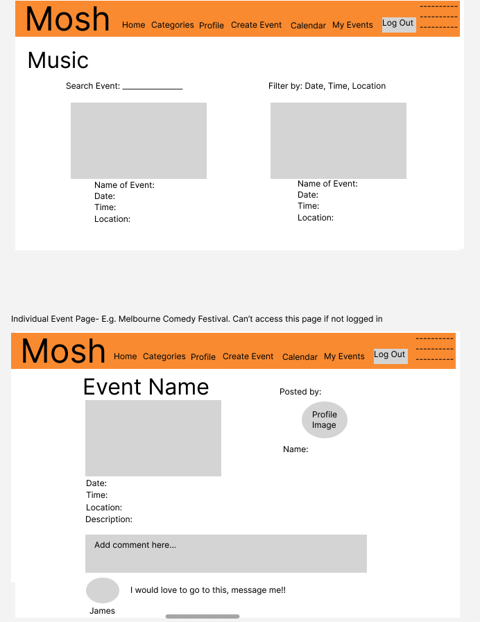
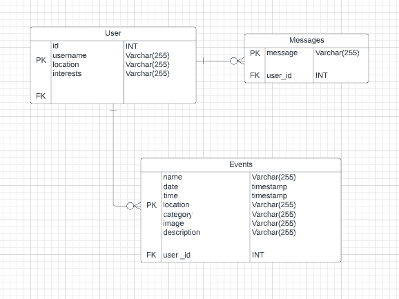
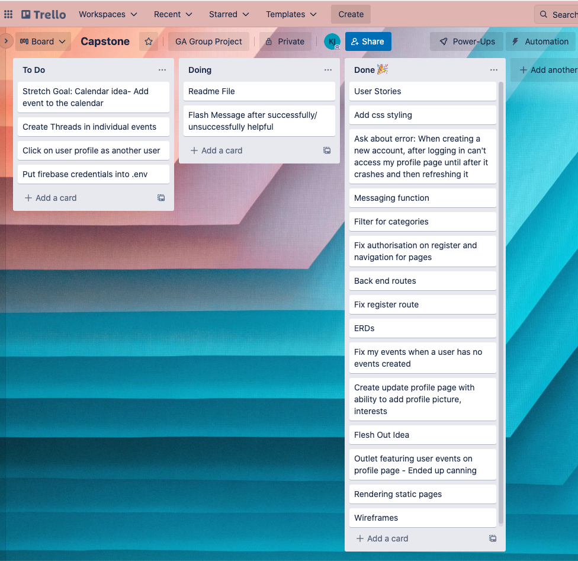

# Mosh 

Everyone has different interests and passions and sometimes it can be hard to find people who share these similar interests. Mosh aims to provide a platform where people can meet like-minded people who are interested in the same things so that they have someone to attend events with. Think of a time when you wanted to go to a concert/ event and none of your friends were interested. Well now, there's a platform that lets you post an event and find other people who would be keen to attend too.

Sample account:

```
Username: demo
Password: demo
```
--- 

## Technology Used

- Javascript
- Python
- HTML5
- CSS3
- Bootstrap
- React
- Flask
- PostgreSQL
- Heroku
- Firebase
- Figma 
- Trello
- Lucid app
- Github
--- 

## Features

- Full CRUD functionality (Create, Read, Update, Delete) functionality for events
- Ability to update user profiles
- Categories for events relating to the specific category, with ability to filter for event
- Account registration, login/ logout authentication and authorisation for certain functions
- Real-time messaging function with all users
---

## User Stories 


*"Chan is an avid music fanatic who loves all kinds of genres. Chan's favourite genre is heavy metal but unfortunately his friendship circle are not big fans and will not attend a concert with Chan. Chan feels awkward going to a gig by himself and wants to be able to find other heavy metal fans who are keen to go to concerts. Providing a platform to facilitate this connection would be great for Chan because he doesn't know how else to meet others."*


*"Flora considers herself to be an older person when she goes out to gigs and events. Flora's friendship circle thinks they're too old to go out but Flora is young at heart and feels held back. Flora wants to be able to go to events without feeling judged for being there by herself or because of her age. Flora wants to still be able to do the things she enjoys and share that experience with someone else."*


*"Jackie does not have a large amount of friend and wants to expand her circle to meet other people. She thinks events are a great way to overcome the awkward barrier of trying to break the ice but doesn't know how to find others who are also looking for friends. Jackie wants an easy way to find events that are of interest to her and with someone else who she could meet up with."*


*"Elliott has a lot of social anxiety when they leave their house but still loves adventuring out and trying new things. Elliott thinks they're ready to try going to event but would like someone who understands their situation so they can be there to make Elliott feel more comfortable. Elliott would love to be able to find someone who would be happy to have them tag along but doesn't know how to reach out. Mosh enables Elliott to find that person for them in a safe space."*

---
## Design and Process

I obviously wanted to tailor the design to suit the user experience as much as possible. This is evident in the registration which only requires location as required personal information with the ability to update interests and profile image in the user profile page. I based my categories off what I thought summarised all events and could cater for any unorthodox ones.

Wireframe using Figma:



ERD using Lucid:



Task Management using Trello:



---
## Challenges

One of the main things I learnt from this project is that Boostrap and Tailwind do not go together. I attempted to use Tailwind for my messaging component and only learnt after I had set everything up that there are clashes between the classes of Tailwind and Bootstrap. I decided to remove Tailwind and convert that all into CSS because the majority of my app used Bootstrap more than Tailwind.

Implementing images within my CRUD functionality was also something I struggled with, especially using Flask since I hadn't used Flask in a previous project so it was all new to me.

---
## Future Functionality

My ideal vision of the website was for it have a gumtree vibe for the individual event pages where users would be able to comment on threads and click on user profiles to then message them individually but with time constraints that was not exactly possible. So that's future functionality instead.